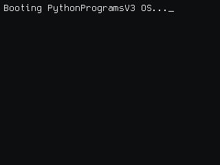

# PythonProgramsV3

This is the upgraded version of V1 (which is deleted) of PythonPrograms!

### 👥 Contributors for this Python Project

- [ModuleMaster64](https://github.com/ModuleMaster64) — Creator & Maintainer  
- [cclauss](https://github.com/cclauss) — Python wizardry & linting expertise

